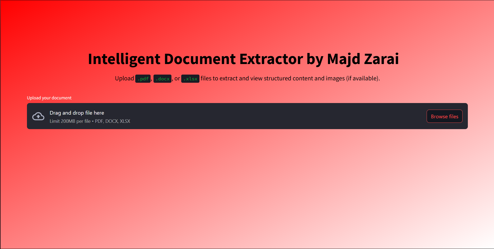
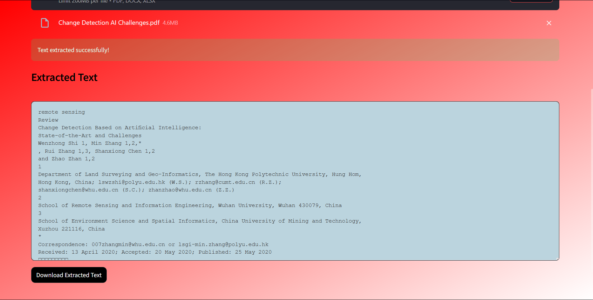

#  Majd Zarai – DYDON AI Internship 2025 Submission

Welcome to my submission for the **DYDON AI Summer Internship 2025**.

I’ve developed a robust and extensible solution to extract structured content from `.pdf`, `.docx`, and `.xlsx` files — with enhancements like OCR fallback for scanned PDFs, image extraction, and a Streamlit-powered web interface.

---

##  Project Overview

This solution fulfills all required tasks and includes several bonus features for better performance, usability, and extensibility:

| Capability                                      | Status   |
|------------------------------------------------|----------|
|  Text extraction from `.pdf`                 | ✔️       |
|  OCR fallback for scanned PDFs               | ✔️       |
|  `.docx` parsing (paragraphs & tables)       | ✔️       |
|  `.xlsx` parsing (multi-sheet, formatting)   | ✔️       |
|  Embedded image extraction from PDFs         | ✔️       |
|  Modular architecture (clean file separation)| ✔️       |
|  CLI script & web UI                         | ✔️       |
|  Frontend: gradient design + image viewer    | ✔️       |

---


## 📂 Project Structure


```text
.
├── Majd_Zarai_text_extractor/
│   ├── pdf_handler.py
│   ├── docx_handler.py
│   └── excel_handler.py
│
├── uploads/
├── extracted_texts/
│   ├── majd_zarai_<filename>_cleaned.txt
│   └── majd_extracted_images_from_pdf/
│       └── <pdf_name>_images/
│           ├── page1_img1.png
│           └── ...
│
├── extract_text_Majd_Zarai.py
├── majd_front.py
├── Majd_assets/
├── DEV_LOG_Majd_Zarai.md
├── requirements.txt
└── README.md

```

---


## 🛠️ How to Run the Application

### Install Requirements
Use the following to install all required packages:
```bash
pip install -r requirements.txt
```
---

### ▶️ CLI Mode

To run the text and image extraction from all documents inside the `uploads/` directory, open a terminal and run:

```bash
python extract_text_Majd_Zarai.py
```

This will create output .txt files and image folders in the extracted_texts/ directory

---

### ▶️ Streamlit Web Interface

To launch the user-friendly web UI, run:

```bash
streamlit run majd_front.py
```

Once the browser opens, you can:
 Upload .pdf, .docx, or .xlsx files via drag-and-drop
 Instantly preview extracted text in a large text box
 Download cleaned text with a single click
 ---

 
 ---
 

